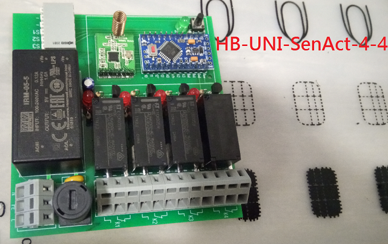
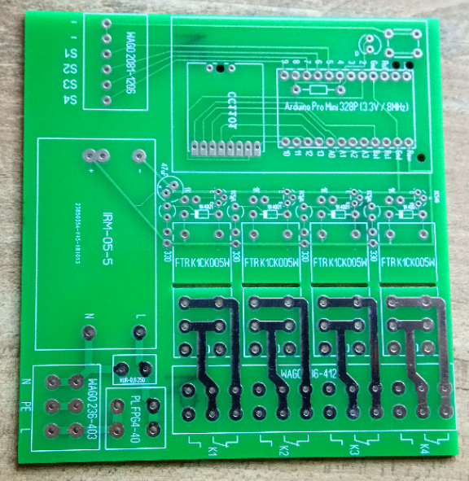

# HB-UNI-SenAct-4-4

# 4 16A Wechelkontakte (Potentioalfrei) + 4 Eingänge (Schalter/Taster)

## benötigte Hardware
* 1x Arduino Pro Mini **ATmega328P (3.3V/8MHz)**
* 1x CC1101 Funkmodul **(868 MHz)**
* 1x FTDI Adapter (wird nur zum Flashen benötigt)

* 1x https://www.reichelt.de/my/1513296

[Kontakt via Facebook](https://www.facebook.com/ronny.thomas.83)

[Software](https://github.com/jp112sdl/HB-UNI-SenAct-4-4) von Jérôme

* Die Leiterbahnen sind bis 6A ausgelegt ggf. zusätzlich Verzinnen!

